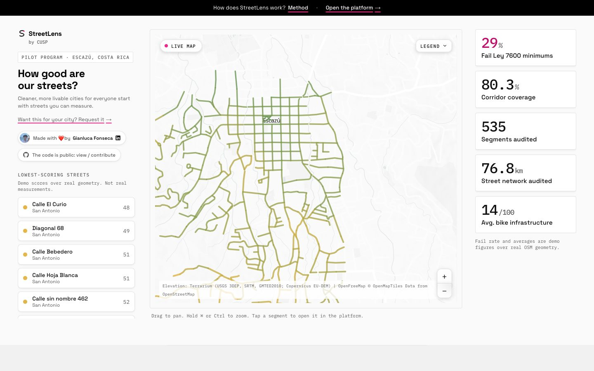
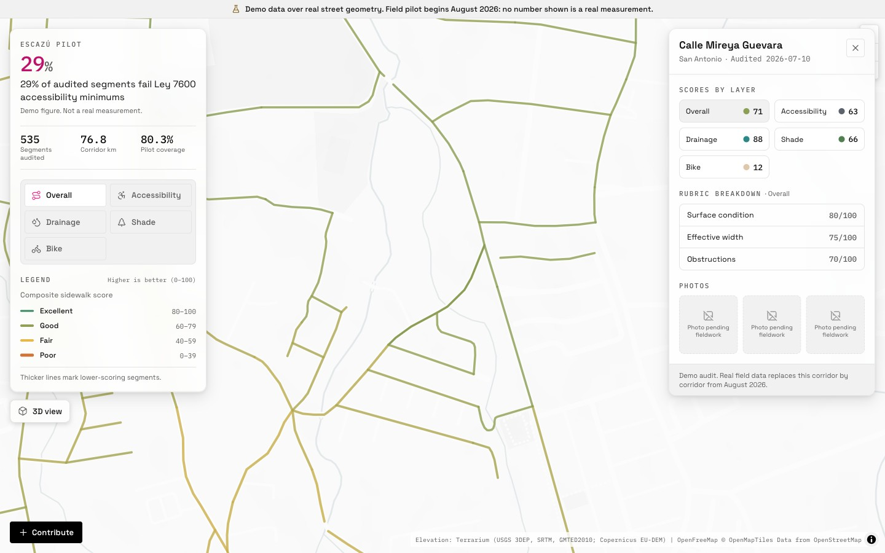
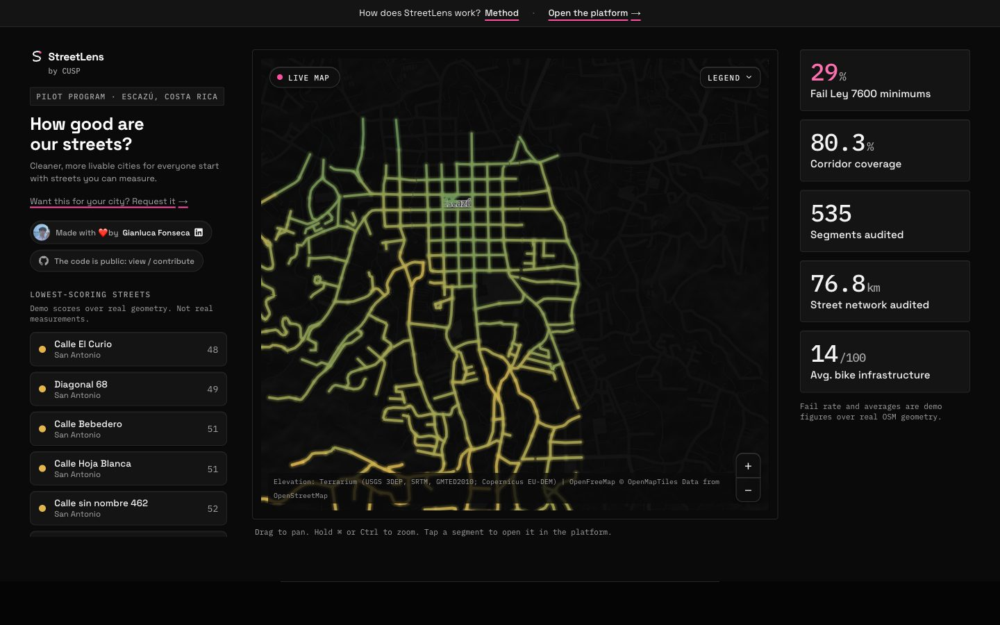
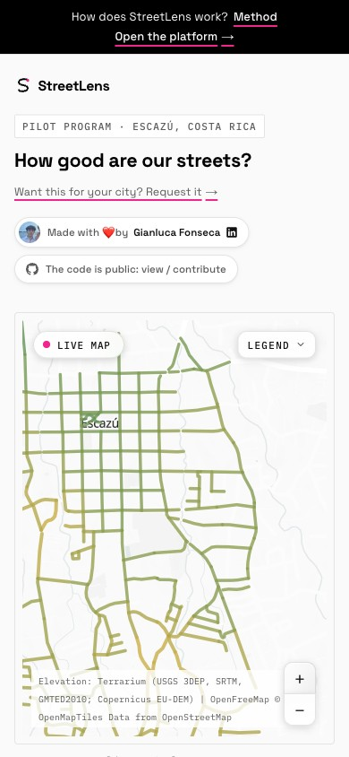
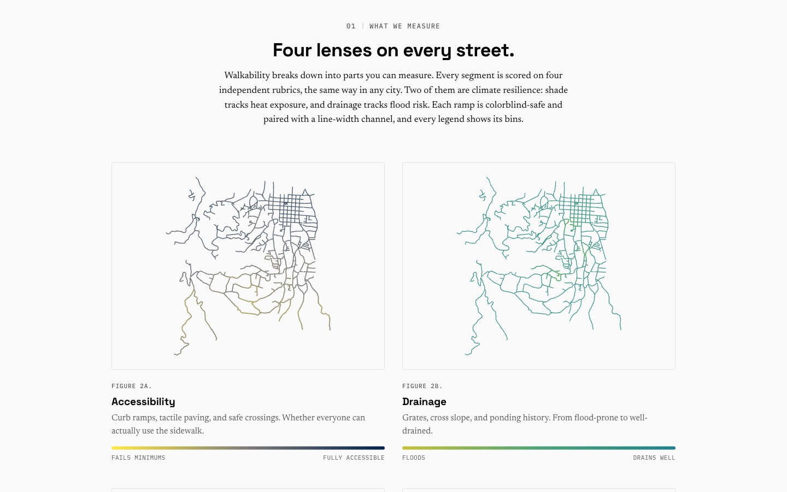
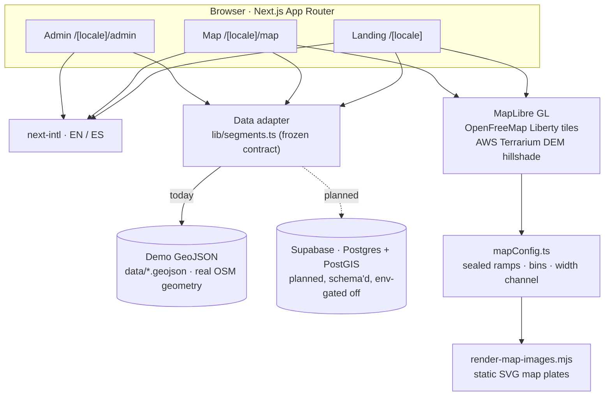
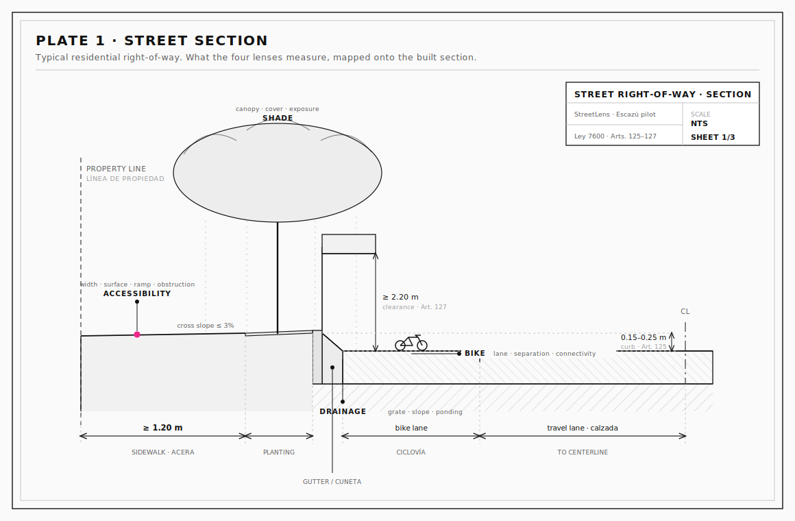
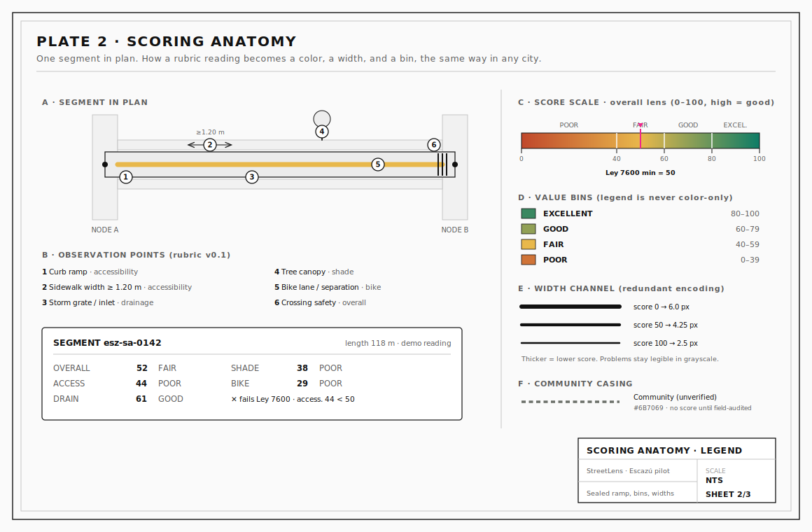
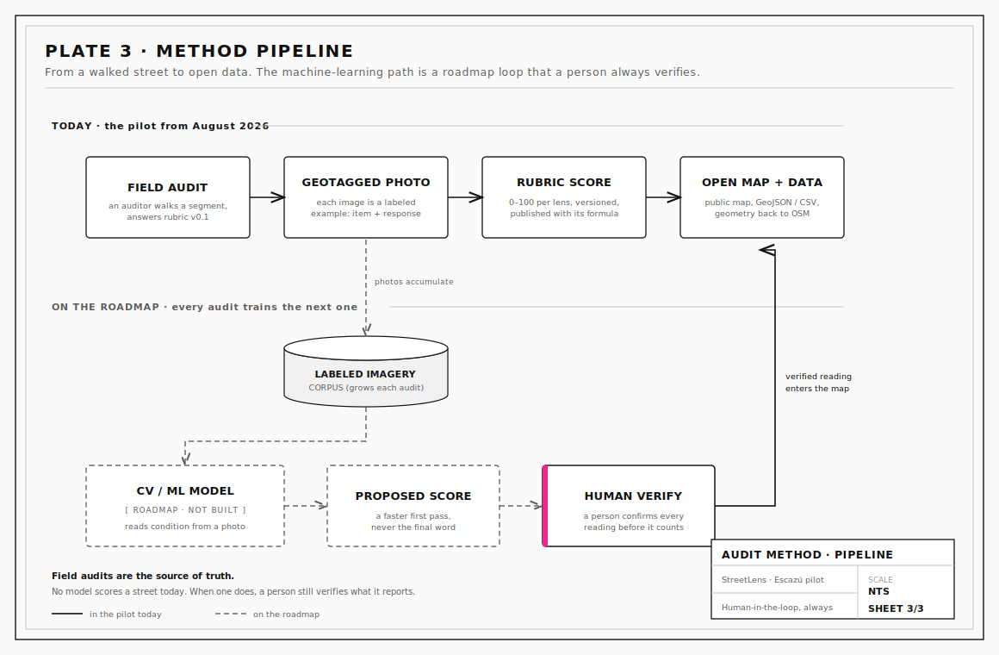

<div align="center">

<picture>
  <source media="(prefers-color-scheme: dark)" srcset="docs/assets/streetlens-mark-dark.svg">
  
</picture>

# StreetLens

**by [CUSP](https://www.joincusp.in/)** · Collective for Urbanism and Sustainable Progress

Cleaner, more livable cities for everyone start with streets you can measure.

<br/>


<br/>



<br/><br/>





</div>

---

## What it is

StreetLens is an open-source, bilingual platform that measures the quality of city streets one segment at a time: how accessible the sidewalk is, how well it drains, how much shade it carries, and whether you can ride a bike on it. The pilot audits the cantón of **Escazú, Costa Rica**, starting August 2026.

Three ideas hold it together.

- **Street quality is not just pavement.** A street is where infrastructure, daily life, and community intersect, and it decides who a city actually serves. Walkability breaks down into parts you can measure, so we measure them.
- **Implementing, not proposing.** Every audit is a real reading someone can act on. The method and the data build a public knowledge base other cities can pick up and run.
- **Grassroots and systemic.** Residents can audit their own streets while the open data gives planners a shared, checkable picture of where the gaps are.

The whole platform is public: the code, the rubric, and the scoring method, open for anyone to read, run, or fork.

### Sobre StreetLens

StreetLens es una plataforma abierta y bilingüe que mide la calidad de las calles, segmento por segmento: accesibilidad de la acera, drenaje, sombra e infraestructura ciclista. El plan piloto audita el cantón de **Escazú, Costa Rica**, a partir de agosto de 2026. El código, la rúbrica y el método de puntuación son públicos. Hoy el mapa muestra datos de demostración claramente etiquetados sobre geometría real de calles; ningún número es una medición real hasta que comienza el trabajo de campo.

---

## The instrument

Every segment is scored on **four independent lenses**, the same way in any city, plus one composite. Each score runs 0 to 100 where higher is better, each ramp is colorblind-safe, and each is paired with a redundant line-width channel so a problem stays legible even in grayscale. Two of the four lenses are a climate-resilience story on their own: shade tracks heat exposure, and drainage tracks flood risk.

<div align="center">

</div>

| Lens | What it reads | Score ramp (sealed) | Low → High |
|---|---|---|---|
| **Accessibility** | Curb ramps, tactile paving, safe crossings, effective width (Ley 7600) | Cividis, pale yellow → deep blue | Fails minimums → Fully accessible |
| **Drainage** | Grates and inlets, cross slope, ponding history | Viridis, dull yellow → blue-teal | Floods → Drains well |
| **Shade** | Tree canopy, cover, sun exposure | Bone → deep canopy green | Exposed → Full canopy |
| **Bike** | Lanes, separation from traffic, connectivity | Sand → copper | None → Protected |
| **Overall** | The composite sidewalk score | Clay → amber → teal (high = good) | Poor → Excellent |

Scores are grouped into four legend bins, and the legend is never color-only:

| Bin | Range |
|---|---|
| Excellent | 80–100 |
| Good | 60–79 |
| Fair | 40–59 |
| Poor | 0–39 |

The ramps, bins, and width channel live in `components/mapConfig.ts` and are treated as sealed: on the grayscale basemap the score ramp is deliberately the loudest color on screen. Community-contributed segments never borrow a score color. They render in a neutral dashed casing until a field audit verifies them.

---

## Method

The rubric derives from validated instruments rather than invented ones: **MAPS-Mini** (the Microscale Audit of Pedestrian Streetscapes), the **LANAMME-UCR** sidewalk-condition work, Costa Rica's **Ley 7600** accessibility law, and open drainage-mapping practice. Rubric **v0.1** is 15 items across the lenses, each with a fixed response type. The rubric is data, not code, and every version is permanent so old audits stay interpretable.

Accessibility is anchored to real law. Under the Reglamento a la Ley 7600 (Decreto Ejecutivo N° 26831-MP), a sidewalk must be at least **1.20 m** wide with a cross slope no steeper than **3%** (Art. 125), curb ramps at every corner must not exceed a **10%** gradient and must be at least **1.20 m** wide (Art. 126), and overhead signs must clear **2.20 m** (Art. 127). Those figures are the ones drawn on Plate 1, not placeholders.

The path from a walked street to a public score is deliberately honest about what runs today and what does not:

1. **Field audit.** An auditor walks a segment and answers the rubric.
2. **Geotagged photo.** Each image is a labeled example: rubric item, response, and picture.
3. **Rubric score.** 0 to 100 per lens, versioned, published with its formula.
4. **Open map and data.** Public map, GeoJSON and CSV exports, sidewalk geometry contributed back to OpenStreetMap.

Every audit trains the next one. The photos accumulate into a labeled-imagery corpus that, over time, is meant to train a computer-vision and machine-learning pipeline reading sidewalk condition straight from a photo, so future audits score faster than the last. **No model scores a street today.** When one does, a person still verifies what it reports. That loop, and the line between today and the roadmap, is Plate 3.

---

## Architecture



The single read surface is a frozen data adapter (`lib/segments.ts`): it tries Supabase first and falls back to committed demo data, so the app runs end to end today with no database. The map's ramps and width rules live once in `mapConfig.ts` and are mirrored into the render script that bakes the static SVG plates.

| Layer | Choice |
|---|---|
| Framework | Next.js 16 (App Router, React Server Components), React 19, TypeScript 5 |
| i18n | next-intl, English and Spanish (es-CR) at parity |
| Map | MapLibre GL · OpenFreeMap Liberty vector tiles · AWS Terrarium DEM |
| Styling | Tailwind CSS v4 · Space Grotesk, Newsreader, IBM Plex Mono |
| Data | Frozen adapter: static demo GeoJSON today, Supabase (Postgres + PostGIS) planned |
| Geometry | Turf, `geojson-path-finder` (street-following trace) |
| Validation | Zod |
| Hosting | Vercel |

More depth: [`docs/architecture.md`](docs/architecture.md).

---

## Engineering drawings

Three drawing sheets, drawn in the project's zen instrument style, with real dimensions where a standard applies.

**Plate 1 · Street right-of-way cross-section.** The four lenses mapped onto the built section, dimensioned to Ley 7600 (Arts. 125–127).



**Plate 2 · Scoring anatomy.** One segment in plan: rubric observation points, the sealed ramp, the four bins, the width channel, and the neutral community casing.



**Plate 3 · Method pipeline.** From a walked street to open data today (solid), with the computer-vision and machine-learning path drawn as a roadmap loop that a person always verifies (dashed).



---

## Data and honesty

- **Demo data is always labeled.** Everything on the public map today is demo data generated over real OpenStreetMap geometry, so the map behaves exactly as it will with field data. Real measurements replace it corridor by corridor once fieldwork begins in August 2026. No number shown on a demo surface is a real reading.
- **Scores publish with their formula.** Each lens is scored from a rubric of observed items, higher is better, and the legend always shows the value bins.
- **Community contributions stay unverified until audited.** Resident-added segments carry no score and render in a neutral casing until a field audit confirms them.
- **Machine learning is on the roadmap, not in today's numbers.** There is no model scoring streets, and there is no "AI-powered" claim. When a model is built, a human still verifies every reading.
- **Open by default.** Open code, open rubric, open method, GeoJSON and CSV exports, and sidewalk geometry contributed back to OpenStreetMap.

Full method and rubric detail: [`docs/method.md`](docs/method.md).

---

## Getting started

```bash
git clone https://github.com/gianluca-fonseca/streetlens.git
cd streetlens
npm install
npm run dev
```

Open <http://localhost:3000>. No environment variables are required: the app serves demo data over real OSM geometry out of the box.

Optional configuration is documented by **name only** (never commit secret values). Point the adapter at a Supabase instance with `NEXT_PUBLIC_SUPABASE_URL` and `NEXT_PUBLIC_SUPABASE_ANON_KEY`; the admin queue reads `ADMIN_PASSWORD` and `ADMIN_RPC_SECRET`. Copy `.env.local.example` if present, or export them in your shell. See [`CONTRIBUTING.md`](CONTRIBUTING.md).

---

## Contributing

Contributions are welcome: code, translations, rubric review, and street audits once the pilot opens. Start with [`CONTRIBUTING.md`](CONTRIBUTING.md) for setup, the gates to run, the English/Spanish parity rule, and the honesty rules every contributor keeps.

**Request your city.** StreetLens is built so Escazú is the pilot, not the boundary. If you want your city measured, [open an issue](https://github.com/gianluca-fonseca/streetlens/issues/new?title=City%20request:%20).

---

## License

[MIT](LICENSE) © 2026 Gianluca Fonseca.

## Author

Built by **Gianluca Fonseca** for [CUSP](https://www.joincusp.in/), the Collective for Urbanism and Sustainable Progress. [LinkedIn](https://www.linkedin.com/in/gianluca-fonseca/).
