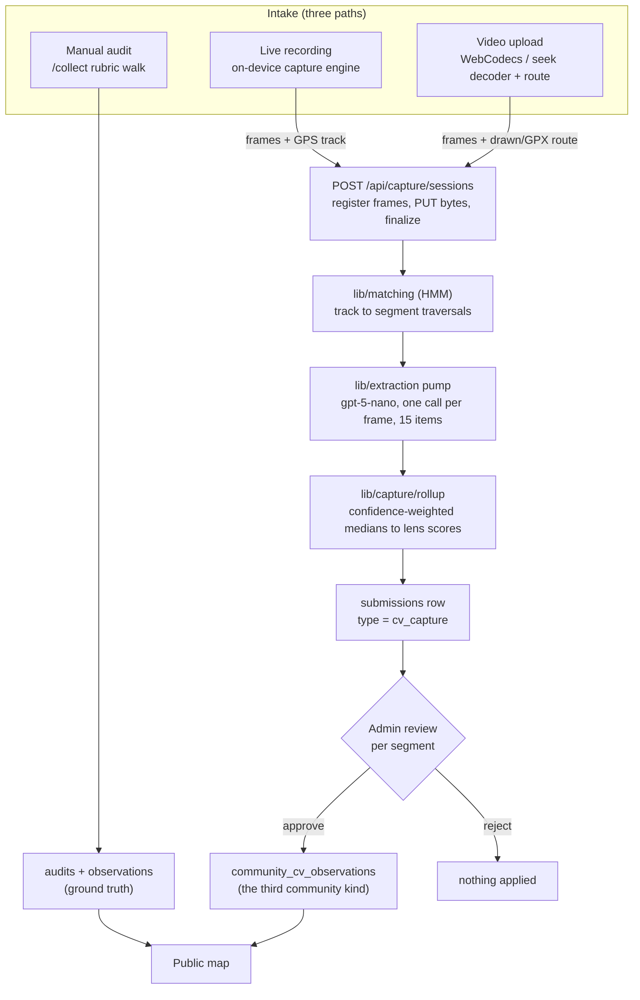

# The CV data-collection funnel

A contributor films a street. We place the frames on the street network, ask a
vision model to score them against the same rubric a human field auditor uses,
and hand the result to a reviewer.

This document is the map of that pipeline and the reference for its contracts.
It describes the code as shipped, not as planned. Where a shape here disagrees
with the code, the code is right and this doc is stale.

## Why it exists

A field audit is one person, one clipboard, one street at a time: thorough,
slow, and hard to scale past a district. A capture is a walk with a phone. If a
capture can produce rubric v0.1 scores that a reviewer trusts, coverage stops
being bounded by auditor-hours.

The whole design follows from one constraint: **CV output is a proposal, not
data.** It enters the same review queue a manual contribution does, and nothing
it produces reaches the published map without a human approving it. Every
decision below that looks conservative is downstream of that.

## The funnel in plain language

**What the CV is scanning for.** Each frame from a street walk is sent to a
vision model (gpt-5-nano, escalating to gpt-5.4-mini on low-confidence frames)
in a single structured call that evaluates the street against the same rubric
v0.1 a human auditor uses: 15 items across the four lenses. Concretely it reads
things like sidewalk presence and effective width, curb ramps, surface
condition, drainage grates and standing water, tree canopy and shade cover, and
bike infrastructure (lanes, separation, surface). The response is forced
through a strict JSON schema, so every frame comes back as structured rubric
readings, not free text.

**Does it assign a score? Yes, in two stages.** Per frame it produces the 15
rubric item readings plus a confidence. Then, per street segment, all frames
matched to that segment are rolled up with confidence-weighted medians into
lens scores from 0 to 100: accessibility, drainage, shade, bike, and an overall
composite (0.45 x accessibility + 0.30 x drainage + 0.25 x shade, with bike
kept separate). A lens no frame could support stays null (unknown), never zero.

**Upload flow.** Two paths, both frames-only; raw video never leaves the phone:

1. **Live recording**: the browser opens the camera, samples roughly one frame
   per second gated by GPS movement, filters blurry and duplicate frames, and
   uploads frames directly to Supabase storage as you walk.
2. **Video upload**: you pick a POV video, the browser decodes it locally
   (WebCodecs fast path or a fallback decoder), samples frames, and pairs them
   with a GPX track or a route you trace on the map, since phone videos carry
   no GPS track.

Either way the lifecycle is the same: a session is created, frames are
registered (which arms the storage upload policy), bytes upload, finalize runs
HMM map matching to pin each frame to an exact street segment, a job queue
extracts each frame through the vision model, rollups are computed, and the
session lands in the review queue.

**Approval: never automatic.** This is a hard design rule. A finished session
files itself into the same admin review queue as manual submissions (as a
`cv_capture` type). An admin opens the review page, sees per-segment scores
with the frame filmstrip and token and cost stats, and approves or rejects per
segment with a required reason. Only approved segments land in
`community_cv_observations` and appear on the map, marked with a provenance
chip as CV-derived; re-reviewing and unticking a segment removes it. Nothing
reaches the published map without a human ticking it.

## How the model works, end to end

This section exists because the product shows numbers a reader is entitled to
understand: the small percentage next to every item a frame reads, and the two
scores (baseline and adjusted) a reviewer sees side by side. What follows makes
each of those numbers self-explanatory, in order, with one worked example per
idea. It is written for a careful reader who is not an ML person; every claim
is checked against the code and cites where it lives.

### 1. What one frame becomes

A frame is one photo from a walk. It goes to the vision model in a single
structured call, and comes back as fifteen rubric readings plus a short note.
There is no chain of calls and no second opinion at this stage: one image in,
one JSON object out (`lib/extraction/client.ts`, `lib/extraction/extract.ts`).

Each of the fifteen items is a pair, `{ value, confidence }`
(`lib/extraction/schema.ts`, `itemSchema`):

- **value** is the reading itself, in the item's own units: a boolean is `0` or
  `1`, a `scale_0_4` item is `0..4`, a percent item is `0..100`. Higher is
  always better, including items phrased as a problem (a low `standing_water`
  reading is a wet street; the rubric wording flips so the number does not).
- **confidence** is a number from 0 to 1: the model's own certainty in *that
  value*, on *that frame*. The schema tells the model exactly this: "0..1, your
  own certainty in this value for this frame. Be honest: a low number is
  useful, a confident guess is not." (`lib/extraction/schema.ts`). The review UI
  renders it as a percent, `Math.round(item.confidence * 100)` followed by `%`
  (`components/admin/FrameInspector.tsx`). So a "60%" next to an item is not an
  accuracy statistic and not a probability the value is right in some measured
  sense. It is the model saying "on this frame, I am 60 percent sure of this
  particular reading."

Two more fields ride along. `frameQuality: { usable, reason }` is the model's
own judgement that the frame can be scored at all (motion blur, lens flare, no
street in shot make it unusable). And one required free-text `rationale`: one to
three plain sentences on what the model saw and why the notable scores are what
they are, for example "Narrow paved road, no sidewalk on either side; dense
canopy left; standing water at the right edge." It is one note per frame, not a
justification per item, and it exists for the human reviewer, who reads one
honest paragraph faster than fifteen (`lib/extraction/schema.ts`, the
`rationale` description).

**Null is a first-class answer, and it is never a zero.** When the crossing is
behind the camera or the sign is out of shot, the value comes back `null`,
meaning "not assessable from this frame" (`lib/capture/types.ts`, and the
nullable value schemas in `lib/extraction/schema.ts`). A zero says "I looked and
it is bad"; a null says "I could not look." The rollup skips nulls entirely
(`lib/capture/rollup.ts`), because scoring a null as a zero would quietly punish
a street for being photographed from the wrong angle. The UI honors the same
line, showing a null as "not assessable", never as 0
(`components/admin/FrameInspector.tsx`).

### 2. Image economics, in two sentences

Every frame is re-encoded server-side to a longest edge of 512 px before it is
sent, so the model never sees the full-resolution image and cannot bill for
pixels it was not handed (`lib/extraction/downscale.ts`); the large, constant
part of each request (a byte-identical system prompt and the strict schema) is
sent as a cacheable prefix, so after the first frame the provider charges its
reduced cached-input rate for most of the request
(`lib/extraction/prompt.ts`, the "Prompt caching" note in the Extraction
section below). The cheap model runs first and a frame escalates to the stronger
one only when it is genuinely unsure (section 3b). The real measured token
counts and how they convert to money live in the **Cost model** section further
down; this section is only about where the numbers come from, not what they are.

### 3. Where confidence actually does work

Confidence is not decoration. It changes three concrete things.

**(a) It weights the rollup's median.** When several frames of one segment read
the same item, the rollup does not average them and does not take a plain
median. It takes a confidence-weighted median (`lib/capture/scoring.ts`,
`confidenceWeightedMedian`): entries are sorted by value, and the winning value
is the first one at which the running sum of confidence crosses half of the
total confidence. Ties fall to the lower (more conservative) value.

> Worked example. Three frames read one `scale_0_4` item (say surface
> condition) as 4 at 90% confidence, 2 at 60%, and 1 at 40%. Sorted by value:
> `1@0.40, 2@0.60, 4@0.90`. The total confidence is 1.90, so half is 0.95. Walk
> the sorted list accumulating confidence: after the "1" you are at 0.40 (below
> 0.95), after the "2" you are at 1.00 (past 0.95), so the weighted median is
> **2**. Note what did not happen: the plain average would be about 2.3, and the
> single most-confident frame's "4" did not drag the answer up to 4. A median
> means one confidently-wrong outlier cannot move the result, and the confidence
> weighting means a 40%-sure dissent counts for less than a 90%-sure agreement.

**(b) It triggers escalation, and the escalated answer wins.** After the cheap
model (`gpt-5-nano`) scores a frame, the worker escalates that one frame to the
stronger model (`gpt-5.4-mini`) when the frame is `usable` AND at least one item
came back with a non-null value below `ESCALATION_CONFIDENCE_THRESHOLD` (0.35)
(`lib/extraction/config.ts`, and the Extraction section's "Model and
escalation"). A low-confidence *null* does not escalate: an honest "cannot see"
is not the same as a hedged guess. Escalation reuses the already-downscaled
512 px image, is capped at `floor(frameCount * 0.1)` per session so poor light
cannot silently reprice the whole walk at the expensive model, and when it runs,
the stronger model's answer is the one that counts. In the rollup a frame that
escalated has two observation rows and only the escalated one votes, so a single
frame never votes twice (`lib/capture/rollup.ts`, "One vote per frame").

**(c) It tells the reviewer where to look.** A wrong value at low confidence is
the model flagging itself: it already told you it was unsure, and the rollup
already discounted it, so it is rarely worth a reviewer's override. A wrong value
at high confidence is the error worth catching: the model was certain and wrong,
which is exactly the case the weighted median cannot protect against and a human
can. So the inspector shows value and confidence together on every item
(`components/admin/FrameInspector.tsx`): the confidence is a reading-priority
hint, not a grade.

### 4. From frames to a segment score: the baseline

The per-segment score, before any reasoning on top, is a deterministic pipeline
in `lib/capture/rollup.ts` (`computeRollups`) and `lib/capture/scoring.ts`. It
runs the same four steps every time and in an order that does not depend on the
order the frames arrived. This is the **baseline**: auditable, reproducible, and
by construction order-blind.

1. **Median per item.** For each of the fifteen items, the confidence-weighted
   median across the segment's frames (section 3a). Junction items (`curb_ramp`,
   `crossing_safety`) read only frames taken at a junction; every other item
   reads only non-junction frames, so a crossing is scored from frames at the
   crossing, not mid-block (`lib/capture/rollup.ts`). A null or missing value is
   skipped, never counted as 0.
2. **Normalize to 0..1.** Each item median is put on a common scale by its
   response type: a boolean is already `0` or `1`, a percent is `value / 100`, a
   `scale_0_4` is `value / 4` (`normalizeItemValue` in `lib/capture/scoring.ts`).
3. **Average into lens scores.** The normalized items are grouped by lens and
   averaged (`lensScoresFromItems`): five accessibility items, three drainage,
   two shade, two "overall" display items, three bike. A lens no frame could
   assess stays `null`, not 0.
4. **The overall composite.** `overall = 0.45 * accessibility + 0.30 * drainage
   + 0.25 * shade`, renormalized over whichever of those three lenses were
   actually measured, and **bike stands alone** (it is its own lens, never part
   of the composite). Final scores are multiplied by 100 and clamped to 0..100
   (`renormalizedOverall`, `OVERALL_WEIGHTS`).

> Worked example. A segment's frames give accessibility 0.70 (normalized) and
> shade 0.50, but no frame could assess drainage, so drainage is null. The
> composite renormalizes over the two lenses present: `(0.70 * 0.45 + 0.50 *
> 0.25) / (0.45 + 0.25) = 0.44 / 0.70 = 0.63`, so overall is about 63. The null
> drainage does not drag the street to a zero; it simply does not vote, and the
> two lenses that were measured are reweighted to still sum to one.

> One deliberate quirk (`lib/capture/scoring.ts`): `lighting` and
> `crossing_safety` map to the "overall" display layer but do NOT feed the
> `overall` composite, which keeps a CV overall byte-comparable with the
> demo-audit generator's definition of the same number.

### 5. The synthesis stage: a bounded, reasoned correction

An average of medians erases the shape of a walk. It cannot see that a crosswalk
present at the top of a block vanishes for the next two hundred metres, or that
the one drain sits nowhere near where the water pools. Those are facts *across*
frames, and a per-item median is blind to them. Synthesis
(`lib/extraction/synthesis.ts`) is a second, text-only model call per segment
that reads the walk in order and corrects the baseline within a hard bound. It
runs in the pump after the rollup is computed and persisted, before the session
is filed for review (`lib/capture/pump.ts`, `synthesizeSession`).

**What it reads.** The segment's frames in traversal order, each with its `seq`,
its distance along the walk (a haversine between consecutive frame GPS
positions), its near-junction flag, all fifteen item readings with their
confidences, and the per-frame rationale, plus the baseline lens scores and the
item medians. It also gets a continuity block that, for the presence items
(sidewalk, curb ramp, crossing, drain, bike lane), spells out the runs of
present / absent / not-assessable along the walk with their distance spans. That
block is what turns "a crosswalk, then none for a long stretch" into something
the model can weight. The evidence is text only, no images, and deterministic
(the same frames build the same bytes).

**What it may do.** For each of the four measured lenses it may propose a delta
in points, added to (or subtracted from) the baseline, bounded to at most
`CV_SYNTHESIS_MAX_ADJUST` points either way (default 20)
(`lib/extraction/config.ts`, `synthesisMaxAdjust`). The arithmetic is ours, not
the model's: `adjusted = clamp(baseline + boundedDelta, 0, 100)`
(`lib/capture/review-overrides.ts`, `computeAdjusted`). The composite `overall`
is never taken from the model; it is recomputed from the adjusted lens values
with the same renormalized 0.45 / 0.30 / 0.25 formula the baseline uses, so
"72" means the same thing whether it came from the rollup or from synthesis.

**What it may not do.** It may not move a number without a written reason: every
non-zero delta must carry one, and a delta whose reason is blank is dropped to
zero before it is applied (`lib/extraction/synthesis.ts`, `if (delta !== 0 &&
reason.length === 0) delta = 0`). It may not exceed the bound (anything larger is
clamped). It may not invent a lens: a lens whose baseline is null stays null,
though the model may still explain in that lens's text *why* it is unknown. And
it may not set the overall directly.

> Two canonical examples of what sequence reasoning catches that a median
> cannot. **Crosswalk gap:** frame 1 at 0 m shows a crosswalk, then the next
> frames across 200 m show none. The median over the accessibility items can
> still read "crossing present" because one strong frame carried it, but the
> continuity block shows present-then-absent, so synthesis can argue
> accessibility down (say a delta of -15, reason citing the gap) where the
> average could not. **Intermittent drain:** a single drain grate scores well on
> the one frame that catches it, but standing water shows up in frames a hundred
> metres downhill; the median sees "a drain" and "some water" as separate item
> facts, and only reading them in sequence reveals that the drainage does not
> serve where the water actually collects.

**Synthesis never blocks a session.** It is a later, independently fallible step
decoupled from the rollup: a synthesis that throws, times out, or returns a
malformed answer is logged and leaves the assessment null; the baseline rollup
stands and the session still reaches `review_ready`. It respects the same
`CV_EXTRACTION_ENABLED` kill switch as every other spend, and its own tokens are
counted into the review read's token ledger (see the Synthesis section below for
the stored shape and persistence details).

### 6. The human layer: baseline, adjusted, and what lands

Nothing a model produced reaches the public map on its own. A reviewer opens the
session in the workbench (`components/admin/CaptureReview.tsx`) and sees, per
segment, two numbers per lens: the **baseline** (the deterministic rollup) and
the **adjusted** value (baseline plus the synthesis delta). The adjusted value is
the default proposal. The reviewer has four kinds of control, and they all flow
through one pure recompute so the numbers on screen are byte-identical to the
numbers that land (`lib/capture/review-overrides.ts`, `recomputeReview`, run
client-side for the live preview and server-side as the authoritative persist):

- **Use baseline, per lens or per segment.** A one-tap control declines the
  synthesis adjustment for a single lens (reverting it to the recomputed
  baseline), and a segment-level control reverts them all
  (`CaptureReview.tsx`, `toggleBaselineLens` / `setSegmentBaseline`).
- **Item overrides.** In the frame inspector a reviewer can replace any item's
  value on any frame. A human reading is an assertion, not a guess, so it is
  minted with full confidence (`OVERRIDE_CONFIDENCE = 1` in
  `review-overrides.ts`), which means it participates in and dominates the
  confidence-weighted median for that item. A null override drops out exactly
  like a model null.
- **Frame exclude and delete.** Excluding a frame removes it from scoring
  immediately but reversibly; it stays visibly struck in the filmstrip and on
  the map. Deleting is for privacy and is irreversible: the secret-gated
  `capture_delete_frame` RPC removes the bytes and the row and records a
  tombstone so the record never lies about how many frames a walk had. A deleted
  frame never scores.
- **Manual score edit.** A reviewer can type a lens score by hand, and it wins
  over both the baseline and the adjusted value.

**The exact recompute order is a contract** (`review-overrides.ts`,
`recomputeReview`, and the Segment synthesis section below):

```
drop deleted frames
  -> drop excluded frames
  -> apply item overrides (each at full confidence)
  -> computeRollups  (the real rollup math, producing a FRESH baseline)
  -> synthesis adjustment: the clamped delta rides the fresh baseline
  -> per-lens "use baseline" opt-outs
  -> manual score edits win
  -> drop any segment that lost its last supporting frame
```

The single most important consequence: when a reviewer excludes or corrects
frames, the baseline moves, and the adjusted value is that *moved* baseline plus
the same delta, never the engine's original `adjustedScores` (which were computed
on the original frames). When that happens the explanation prose is flagged
"written before your corrections" (`assessmentStale` in `review-overrides.ts`),
so the reviewer knows the words predate the evidence even though the number is
honest.

**Provenance, and the wall before the map.** Approval is per segment, with a
mandatory reason, and it writes only to `community_cv_observations`; it never
touches an `audits`, `observations`, or `segments` row, so an audited segment's
scores are byte-for-byte identical before and after a CV approval
(`scripts/test-cv-apply.mjs`). Each approved observation carries a
`human_corrected` boolean and a compact `overrides` jsonb recording exactly what
a human changed (item overrides by frame seq, excluded and deleted seqs, manual
edits, baseline opt-outs) (`review-overrides.ts`, `SegmentOverrideRecord`;
migration `0021`). On the map, `community_cv_observations` rides alongside
audited data, never folded into a `score_*`, behind a provenance chip that reads
"Camera: not field-verified", with a "human-corrected" marker when any
observation on the segment was touched (`components/SegmentDetail.tsx`). Nothing
reaches the published map without a person ticking it.

### Reading the review workbench

A compact legend, one line each, mapping what a reviewer sees to what it means.

| Element | Where | Meaning |
| --- | --- | --- |
| `%` next to an item | frame inspector | The model's own confidence in *that* reading on *that* frame (`0..1`, shown as a percent). Not an accuracy statistic. |
| Item value shown struck through | frame inspector | The model's original reading, kept visible after a reviewer overrode it, so nothing is silently rewritten. |
| The per-item dropdown (default "use model") | frame inspector | The override control: leave it to keep the model's value, or pick a new value (or "not assessable") to override at full confidence. |
| `baseline N -> adjusted M` with a signed delta | segment card | The deterministic rollup (baseline) and the synthesis proposal (adjusted); the delta is the bounded nudge, green up, clay down. Adjusted is the default. |
| "use baseline" (per lens) / "use baseline for all" (per segment) | segment card | Decline the synthesis adjustment and keep the recomputed baseline for that lens, or for every adjusted lens at once. |
| "written before your corrections" hint | segment card | The synthesis prose predates a reviewer's frame edits, so the words are stale even though the delta still rides the fresh baseline. |
| A lens score you typed | segment card | A manual edit; it wins over both baseline and adjusted, and a small dot marks the lens as edited. |
| Frame struck through / dimmed ("excl") | filmstrip, review map | An excluded frame: out of scoring but reversible and still shown. |
| Frame tombstone (seq only, no image) | filmstrip, review map | A deleted frame: bytes gone for privacy, the seq kept so the count stays honest. |
| Numbered dots on the map | review map | Each frame at the position the pipeline recorded; grey means unmatched (off-network), dim means excluded, tombstoned means deleted, and the polyline is the GPS track (`components/admin/ReviewMap.tsx`). |
| "not assessable" | anywhere a value shows | A null reading: the model could not see it. Distinct from a zero, and it never scores. |

## Three ways in, one way out

There are three ways a street's condition enters StreetLens, and they converge
on one review queue:

1. **Manual audit** (`/collect`, the tracked-walk flow): a human answers the
   rubric segment by segment. This is the ground truth the CV funnel is
   measured against and never overwrites.
2. **Live recording** (`/collect`, camera mode): the phone films while it walks,
   an on-device engine keeps only the frames worth keeping, and the frames plus
   a GPS track upload for server-side scoring.
3. **Video upload** (`/collect`, upload mode): a contributor uploads a video
   they already shot, draws or imports the route it followed, and the same
   extraction runs. Phone videos carry no usable GPS, so the route is always
   supplied by hand.

Paths 2 and 3 produce the identical artifact: JPEG frames in a bucket plus a
`TrackPoint[]`. From `finalize` onward they are indistinguishable. All three
paths end as a reviewable proposal that a human approves or rejects; only an
approval reaches the map.



## The pipeline, step by step

```
  phone  1  POST /api/capture/sessions            -> sessionId (the capability)
         2  POST .../[id]/frames                  -> registers frames, arms upload
         3  PUT  streetlens-frames/captures/...   -> bytes, direct to storage
         4  POST .../[id]/finalize                -> attaches track, enqueues jobs

  server 5  lib/matching                          -> track to segment traversals
         6  POST /api/capture/pump                -> claims jobs, extracts, writes observations
         7  lib/capture/rollup                    -> per-segment medians (staged)
         8  lib/extraction/synthesis              -> per-segment nuanced assessment (staged)
         9  submissions (type cv_capture)         -> the review queue
        10  admin approve                         -> community_cv_observations -> map
```

Status moves: `pending_upload -> uploading -> matching -> extracting ->
review_ready -> approved | rejected`. Off-path: `cost_paused` (extraction budget
exhausted; frames intact, a human resumes it; a stop, not an error) and `failed`
(terminal). The enum is enforced in the database CHECK on `capture_sessions`
(`supabase/migrations/0013_capture.sql`) and mirrored in `lib/capture/types.ts`.

## Contracts

Everything below has ONE definition, and this doc points at it rather than
restating it.

| Concern | Source of truth |
| --- | --- |
| Types (track, frames, session, observation) | `lib/capture/types.ts` |
| Runtime validation | `lib/capture/schemas.ts` |
| Map matching interface | `lib/matching/types.ts` |
| Extraction request, schema, config | `lib/extraction/` (`client.ts`, `schema.ts`, `config.ts`) |
| Aggregation and scoring | `lib/capture/rollup.ts`, `lib/capture/scoring.ts` |
| Tables, RPCs, storage policy | `supabase/migrations/0013_capture.sql` |
| Storage policy fix (the RLS-under-anon bug) | `supabase/migrations/0016_capture_storage_policy_fix.sql` |
| Submission type vocabulary | `supabase/migrations/0014_submission_types.sql` |
| Worker RPCs (claim, attribute, token usage) | `supabase/migrations/0015_capture_worker.sql` |
| Review, approval, the third community kind | `supabase/migrations/0017_capture_review.sql` |
| Per-frame rationale + observations on the review read | `supabase/migrations/0020_observation_rationale.sql` |
| Reviewer overrides, frame delete, review detail | `supabase/migrations/0021_review_overrides.sql`, `lib/capture/review-overrides.ts` |
| Segment synthesis: apply + persist | `supabase/migrations/0023_assessment_apply.sql`, `lib/capture/review-overrides.ts` |
| Upload orchestration | `lib/capture/upload-client.ts` |

### The rubric is not a new vocabulary

A `CaptureObservation` carries exactly the 15 rubric v0.1 items a human auditor
scores (`scripts/generate-demo-audits.mjs`). That is deliberate: a CV
observation and a field audit must be comparable item-for-item, or the two data
sources cannot live on one map. `scripts/test-capture-schemas.mjs` parses the
keys out of the generator, so a rubric change that forgets `lib/capture` fails
loudly rather than drifting.

Encodings: boolean to `0|1`, `scale_0_4` to `0..4`, percent to `0..100`. Higher
is always better. The item-to-lens map lives in `RUBRIC_ITEM_LAYERS`
(`lib/capture/types.ts`): five accessibility items, three drainage, two shade,
two overall, three bike.

`null` is a first-class value meaning **not assessable from this frame** (the
pole is out of shot, the crossing is behind the camera). It is not a zero.
Rollups skip it; scoring it would quietly punish a street for being
photographed from the wrong angle.

### Attribution is not the model's job

`CaptureObservation` deliberately carries **no `segmentId` and no
`nearJunction`**. Those are derived from the track by `lib/matching`. A model
can say what it sees; it must never assert where it was. Leaving the fields off
the shape makes that mistake unrepresentable rather than merely discouraged.

### Storage paths

`captures/<session-uuid>/frame-<seq, 4 digits>.jpg`, from
`captureFrameStoragePath()` in `lib/capture/types.ts`. Zero-padded so paths sort
in capture order. `CAPTURE_LIMITS` fixes `maxFrames: 400` and `maxFrameBytes:
2_097_152` (2 MB); the seq is validated to `0..9999`, which is why 400 frames
sort lexicographically.

The path is **derived server-side** from the seq. A client-supplied path is
validated against the derived one and otherwise ignored, because a client-chosen
path is the entire attack surface of a bucket that accepts anonymous inserts.

## Architecture

### Capture engine (live recording)

The live engine runs entirely on the phone. It is under
`components/capture/engine/` and `components/capture/hooks/`. Its job is to keep
only the frames worth uploading, and to survive iOS killing the tab.

**Frame clock and visibility.** `useFrameClock.ts` drives one callback per
decoded frame via `requestVideoFrameCallback`, falling back to
`requestAnimationFrame` with a `currentTime` guard so the same frame is not
handed to the gates twice. `onFrame` fires only when `document.visibilityState
=== "visible"`: iOS keeps redelivering the last decoded frame from a hidden
video, which would pin a stale-but-real-looking image to pocket GPS. That is
fabricated data, and the engine records nothing rather than record it. Frames
are stamped in wall-clock `Date.now()`, not the media timestamp.

**The gate order.** `gating.ts` `evaluateFrame` runs the cheap scalar gates
before it pays for any pixels: `no_fix -> cadence -> displacement -> duplicate
-> blurry`. The pixel work (grayscale thumbnail) only happens on a frame that
has already cleared cadence and displacement, so at ~30 fps the ~29 rejected
frames never cost a readback. Thresholds live in one place, `tuning.ts`
(`CAPTURE_TUNING`):

| Knob | Value | Meaning |
| --- | --- | --- |
| `minIntervalMs` | 1000 | Minimum time since the last KEPT frame (1 fps cadence). |
| `minDisplacementM` | 6 | Minimum GPS movement since the last KEPT frame. |
| `duplicateDelta` | 2 | Mean-absolute-difference (0..255) over 32x32 gray; below is `duplicate`. |
| `blurVariance` | 40 | Variance-of-Laplacian floor; below is `blurry`. **Uncalibrated** (see `.planning/evidence/u27/`). |
| `graySize` | 32 | Thumbnail edge for dedupe and blur. |
| `accuracyWarnM` | 25 | GPS accuracy above this raises a UI warning. |
| `jpegQuality` | 0.7 | Stored-frame JPEG quality. |
| `maxLongestSide` | 1024 | Stored-frame longest edge (px). |
| `maxDurationMs` | 1800000 | 30-minute auto-stop (`duration_cap`). |

**Dedupe is not a perceptual hash.** `frame-analysis.ts` `frameDelta` is a mean
absolute difference over the gray thumbnail, chosen precisely because it cannot
false-positive the way a hash-bucket collision can. Blur is a 4-neighbour
Laplacian variance. The dedupe reference is the previous frame that reached the
vision gates, not the last frame kept, so it catches both "moved 6 m to an
identical wall" and iOS hidden-video redelivery.

**Backgrounding and lock.** `useRecorder.ts` listens on `visibilitychange` and
`pagehide` (the latter because iOS tab-switch does not always fire
`visibilitychange`). On hide it closes the current segment, flushes the manifest
to OPFS immediately, and calls `stopCamera()` so the OS recording indicator is
not left lit while nothing is being recorded. `resume()` opens a new sub-segment
and clears the gate memory, so the first frame back is kept rather than measured
against a minutes-old position. `useWakeLock.ts` re-acquires the screen lock on
`visibilitychange` because the browser drops it on hide; iOS low-power mode can
refuse outright.

**OPFS is write-through.** `opfs.ts` writes every kept frame and the updated
manifest to the Origin Private File System the instant they exist; nothing is
held in memory waiting for the walk to end. iOS discards a backgrounded tab's
memory without warning, so a crash loses at most the frame in flight, not the
walk. Support is probed by feature
(`FileSystemFileHandle.prototype.createWritable`), not by browser sniffing, and
falls back to an in-memory store marked `durable: false` when OPFS is unusable
(private browsing). Writes are serialized through a queue because OPFS writable
handles are exclusive. A `QuotaExceededError` ends the session cleanly with a
"storage full" state; any other write error tallies `write_failed` and the walk
continues.

### Video-upload intake

The upload path (`components/capture/engine/video-*.ts`,
`components/capture/hooks/useVideoUpload.ts`) turns a file the contributor
already shot into the same frames-plus-track artifact. Forced screen order:
pick, extract, route, review, upload.

**Two decoders, one artifact.** WebCodecs is the fast path
(`video-extract.ts`); a plain `<video>` element seek loop is the fallback
(`video-seek.ts`). Both encode through the shared `frame-encode.ts` and plan
through `video-plan.ts`, so which decoder ran is invisible downstream and is not
recorded. WebCodecs can fail over to the seek path mid-extraction, when
`isConfigSupported` says yes but `configure` then throws.

**Streaming demux.** `video-demux.ts` slices the file in 4 MB chunks via
`Blob.slice().arrayBuffer()`, so peak memory is one chunk whether the file is
40 MB or 4 GB. This is not optional on iOS: `File.arrayBuffer()` on a 200 MB to
2 GB POV walk kills iOS Safari around 100 to 200 MB with no catchable error, and
the tab is simply gone. Two mp4box settings are load-bearing and pinned by
`scripts/test-mp4box-contract.mjs`: `keepMdatData: true` (the default discards
sample data and silently yields zero frames) and `releaseUsedSamples` (without
it mp4box holds every buffer and the slicing is theatre).

**Rotation and B-frames.** Phones write a landscape sensor frame plus a
transform matrix. A `<video>` element honours it for free, but `VideoDecoder`
does not, so the demux reads the matrix (`readRotation`) and the encoder applies
it, or WebCodecs would ship sideways JPEGs while the seek path ships upright. A
16-frame reorder window handles the out-of-presentation-order B-frames that iOS
below 26.4 emits, and every `VideoFrame` is closed in a `finally` because it is
a GPU handle and leaking a few hundred stalls the decoder permanently.

**Extraction does not gate.** Unlike the live engine, the upload path keeps
blurry frames (an uploader cannot re-shoot) and cannot use GPS displacement (no
fixes at extraction time). It samples at 1 fps, or stretches the interval when
`idealCount > maxFrames` so a 20-minute video covers the whole street at a
coarser cadence rather than truncating at 400 frames, and it offsets sample
targets by half an interval to avoid the always-bad first frame and GOP
boundaries.

**Route and clock.** Because the video carries no track, the contributor draws a
trace or imports a GPX file. `lib/capture/gpx.ts` parses GPX with a narrow regex
scanner (not `DOMParser`, which is absent in the node test harness) and rejects
the whole file on any malformed vertex rather than cutting a corner.
`lib/capture/route.ts` `distributeTimesAlongPath` timestamps the route's
vertices by cumulative-distance fraction across `[startT, endT]` under a stated
constant-pace assumption; frames are then placed with the same `interpolateAt`
the live track uses. The video's start time is guessed from `file.lastModified -
durationMs` (the camera writes the file at recording stop), which is why a
clock-nudge slider exists and records its correction in `clock_offset_ms`
without ever mutating a fix. A timed GPX passes its measured times straight
through and is not retimed.

### Upload: direct to storage, armed by registration

`lib/capture/upload-client.ts` runs the funnel: `createSession, registerFrames,
PUT each frame, finalize`, with phases `creating_session, registering_frames,
uploading_frames, finalizing, done`. Frames upload directly to Supabase Storage
via `supabase-js`, never transiting the serverless function, at concurrency 4
with up to 4 retries per object (exponential backoff plus jitter; retryable
statuses `408, 429, 500, 502, 503, 504`). Registration is idempotent: the
`accepted` seqs the server returns are the resume cursor, and only acknowledged
frames are uploaded. `finalize` is the one-way door that enqueues extraction.

**Registration is authorization.** The bucket's insert policy admits an object
only when a `capture_frames` row already exists for that exact path on a session
that still accepts uploads. Registering frames (not holding the anon key) is
what lets bytes land. See the security model below for how the RLS check
actually runs.

### Map matching

`lib/matching/index.ts` picks the active implementation; import from
`lib/matching`, never from an implementation file. Today the active matcher is
`hmm.ts`, a Newson-Krumm Hidden Markov Model (Newson and Krumm, 2009).
`baseline.ts` is retained only as a regression guard, not a runtime fallback:
`scripts/test-matching-hmm.mjs` asserts the naive baseline flips on parallel
streets while the HMM does not.

The HMM's states are `(segment, position)` candidates for each fix. Emission is
a Gaussian on perpendicular distance; transition is exponential on the gap
between great-circle distance and on-network route distance, which is what makes
a jump to a parallel street expensive (a short straight-line hop that is a long
detour on the network). Parameters (`hmm.ts`, defaults, documented in
`lib/matching/README.md`):

| Parameter | Default | Role |
| --- | --- | --- |
| `sigmaZMeters` | 10 | GPS emission noise. Newson-Krumm fit ~4.07 m to car GPS; a phone in hand is noisier. |
| `betaMeters` | 2.0 | Transition decay on the route-vs-crow-flies gap. |
| `gateMeters` | 30 | A fix beyond this from every segment yields no candidates and is cut. |
| `maxCandidates` | 5 | Candidate cap per fix. |
| `maxAccuracyMeters` | 25 | Fixes reporting worse accuracy are dropped in preprocessing (dropout / noise gate). |
| `minStepMeters` | 2 | Consecutive fixes closer than this are dropped (standing still), except the last is always kept. |
| `maxGapSeconds` | 30 | A time hole larger than this forces a fresh sub-trajectory. |
| `junctionRadiusM` | 20 | A frame within this of a segment endpoint node is `nearJunction`. |
| `headingWeight` | 0.5 | Axis-agreement tiebreak (always at most 0). |
| `minTraversalMeters` / `minTraversalFrames` | 10 / 3 | A run shorter than either is absorbed into the nearest strong run (junction flicker suppression). |
| `reversalMeters` | 25 | Out-and-back detection; must clear along-track noise. |

**Junctions** are proxied by shared endpoint nodes (exact 6-decimal coordinate
strings in `graph.ts`); a mid-line crossing is not adjacency. `nearJunction` is
derived per frame from proximity to a traversed segment's start or end node.

**Sub-trajectories.** `viterbi` cuts the track on any of three honest failures
and never bridges the hole: a fix with zero candidates (off-network or beyond
the gate), a time gap over `maxGapSeconds`, or a column where every transition
is `-Infinity` (a teleport the network cannot connect). Each cut is reported as
an `UnmatchedSpan`. The interface (`lib/matching/types.ts`): `matchTrack(track,
opts)` returns `{ traversals, unmatchedSpans, routeLine }`, where each
`SegmentTraversal` carries `segmentId`, enter/exit times, length, and the frame
seqs (and near-junction seqs) that fall in it. `attributeFrames` then maps every
frame seq to `{ segmentId, nearJunction }`, with unmatched frames mapping to
`segmentId: null`.

> **Footgun.** `data/segments.geojson` carries a `metadata.bbox` in Overpass's
> **lat-first** order, which is not the GeoJSON convention. Reading it as-is
> transposes every gate check into the ocean. Compute bboxes from geometry. A
> test keeps this warning from going stale.

### Network coverage: the whole canton, one audited corridor

The matcher works over the entire street network of the cantón of Escazú, so a
capture walk anywhere in the canton pins to real segments. `segments.geojson`
now spans all three districts:

| District | id prefix | `district_id` | segments |
| --- | --- | --- | --- |
| San Antonio de Escazú (pilot) | `esc-sa-` | `esc-san-antonio` | 535 |
| Escazú centro | `esc-ce-` | `esc-escazu` | 93 |
| San Rafael de Escazú | `esc-sr-` | `esc-san-rafael` | 829 |

`scripts/import-osm-corridor.mjs` imports San Antonio first, on its original
bounding box and cache, so the pilot's 535 features stay byte-for-byte identical
across a canton re-import; `scripts/test-canton-identity.mjs` freezes that
against a content hash. The two new districts are fetched by OSM administrative
boundary (Overpass `area`), each raw response cached under `data/raw/` for
offline re-runs. `scripts/build-routing-graph.mjs` unions the same caches into a
canton-wide street-following graph for the client trace tool.

The pilot corridor remains the audited ground truth: only `esc-sa-*` segments
carry rubric scores, and the official stats (`getStats`) count only them. The
rest of the canton is imported unscored (`data/canton-import-segments.json`,
`source: "import"`) and rendered with the neutral community casing, never a score
color, until fieldwork reaches it. `scripts/test-matching-canton.mjs` proves the
production HMM matches a synthetic walk on a real Escazú centro street to its
`esc-ce` segment without flipping districts.

### Extraction

The extraction worker (`lib/extraction/`) scores each frame with one API call.
It talks to the OpenAI **Responses API** over raw `fetch` (no SDK), at
`https://api.openai.com/v1/responses`.

**Model and escalation.** The workhorse is `gpt-5-nano` (`OPENAI_VISION_MODEL`).
A frame escalates to the stronger `gpt-5.4-mini`
(`OPENAI_VISION_ESCALATION_MODEL`) only when the frame is `usable` AND at least
one item came back with a non-null value at confidence below 0.35. A
low-confidence but null item (an honest "cannot see") does not escalate.
Escalation reuses the already-downscaled 512 px image (no re-fetch), a failed
escalation keeps the cheap model's answer, and escalations are capped at
`floor(frameCount * 0.1)` (minimum 1) per session.

**One call, all 15 items, strict schema.** The request asks for every rubric
item at once, as OpenAI structured outputs (`{ type: "json_schema", strict: true
}`, not a tool call, not loose JSON mode). The schema is generated from
`RUBRIC_ITEM_KEYS` and `RUBRIC_ITEM_RESPONSE_TYPES`, not hand-written, so it
cannot drift from the rubric: each item is `{ value, confidence }` with the
value enum matching its response type (boolean `0|1|null`, scale `0..4|null`,
percent `number|null`), plus a `frameQuality: { usable, reason }`.
`additionalProperties: false` everywhere. The `model` field is stamped after the
parse, not requested.

**The per-frame rationale.** Alongside the 15 items the model returns one
required free-text `rationale`: one to three plain sentences on what it saw and
why the notable scores are what they are ("Narrow paved road, no sidewalk on
either side; dense canopy left; standing water at the right edge"). It is a
single per-FRAME note, not a justification per item, which would be 15x the noise
and cost for little review value. It exists for the human reviewer, who reads one
honest paragraph faster than fifteen. The prompt asks for honest, concrete,
non-speculative description under 60 words; the JSON-schema description carries
that instruction rather than a `maxLength` (strict outputs do not honour one, and
a hard cap that fails a paid frame over a few extra words is the wrong trade),
and the zod side keeps a loose 1000-char ceiling. Cost is small and bounded: the
longer response schema adds a handful of input tokens per call (folded into the
derived ceiling automatically), and the rationale itself is a few dozen output
tokens. It is stored on `capture_observations.rationale` (migration 0020, nullable
so pre-rationale rows simply have none).

**Prompt caching.** The cacheable prefix is the `SYSTEM_PROMPT`, sent first in
the `instructions` field, byte-identical on every call (it interpolates nothing
per frame). The per-frame user turn is a constant instruction plus the image,
with no seq, session id, or timestamp that would break the cache. The prefix is
sized to clear OpenAI's ~1024-token caching floor, and cache hits are read back
from `usage.input_tokens_details.cached_tokens`.

**Downscale, server-side.** `downscale.ts` re-encodes each frame to a longest
edge of 512 px at JPEG quality 70 with `sharp`, baking EXIF orientation first,
and sends it as an inline base64 data URL. The full-resolution frame stays in
storage for human review; the model never sees it. This exists because a
provider that ignores the `detail: "low"` hint and bills full resolution returns
a perfectly normal 200: the only defence is to never send the pixels in the
first place. `detail: "low"` is still set ("belt, not braces"), and `store:
false` keeps responses off OpenAI's servers. Note `temperature` is deliberately
**not** sent, because gpt-5 reasoning models reject it with a 400 (found on the
first real call; see the cost section).

**Refusals and malformed answers.** `client.ts` sorts every response into
`refusal | incomplete | unparsable | completed`; anything but a clean completed
answer with parseable JSON that survives a zod re-validation becomes a `failed`
outcome with a machine reason (`json_parse:...`, `schema:...`, `transport:...`),
while still reporting the tokens it was billed. Retries are narrow: only `429`
(except `insufficient_quota`, which can never succeed on retry) and `5xx`, up to
3 attempts with jittered backoff.

### Aggregation

`lib/capture/rollup.ts` `computeRollups` turns per-frame observations into
per-segment lens scores. It is pure and stages its output into
`capture_segment_rollups`; it touches no audit, no community table, no map.

- **One vote per frame.** When a frame escalated (two observation rows), the
  escalated row wins, so a single frame cannot vote twice.
- **Per-item frame selection.** Junction items (`curb_ramp`, `crossing_safety`)
  read only frames where `nearJunction === true`; every other item reads only
  `nearJunction === false`. A crossing is scored from frames taken at the
  crossing, not mid-block.
- **Null skipping.** An item with a null or non-finite value is skipped, never
  treated as 0. If nothing survives, the item median is null with zero frames.
- **Confidence-weighted median.** `scoring.ts` `confidenceWeightedMedian`
  weights by the model's self-reported confidence (0..1), not by frame count:
  entries are sorted by value and the first value whose cumulative confidence
  crosses half the total wins. A median (not a mean) so one hallucinated outlier
  cannot move the answer; ties fall to the lower, more conservative value.
- **Item to lens.** Each median is normalized to 0..1 (`normalizeItemValue`),
  then `lensScoresFromItems` averages per lens. `overall` is a weighted mean of
  accessibility (0.45), drainage (0.30), and shade (0.25), renormalized over
  whichever of those were actually measured; `bike` stands alone. A lens no
  frame could assess is null, not 0. Final scores are `x 100`, clamped 0..100.
  Coverage is contributing frames over frames attributed.

> One deliberate quirk (`scoring.ts`): `lighting` and `crossing_safety` map to
> the "overall" layer for display but do not feed the `overall` composite, which
> keeps a CV `score_overall` byte-comparable with the demo-audit generator.

### Synthesis: the nuanced verdict on top of the numbers

The rollup is an average of medians, and an average erases the shape of a walk.
It cannot see that a crosswalk present at the top of a block vanishes for the
next two hundred metres, that a sidewalk starts and then stops, or that the one
drain sits nowhere near where the water pools. Those are facts *across* frames,
and they are exactly what the user asked the assessment to capture: "it cannot
just be an average", and "there should be an explanation for each of the scores
we output and then explanation overall."

`lib/extraction/synthesis.ts` adds a SYNTHESIS stage: one text-only model call
per segment, on the synthesis model (`synthesisModel()`, defaulting to the
escalation model), that reads the whole traversal in order and writes a nuanced
assessment. It runs in the pump when a session drains (`lib/capture/pump.ts`
`synthesizeSession`), after the rollup is computed and persisted and before the
session is filed for review.

**What it reads.** The segment's frames in traversal order, each with its `seq`,
its distance along the walk (a haversine between consecutive frame GPS positions
from `capture_frames.location`), its `near_junction` flag, the 15 item readings
with confidence, and the per-frame rationale. Plus the baseline lens scores and
the item medians. The evidence also carries a continuity block: for the presence
items (sidewalk, curb ramp, crossing, drain, bike lane) it spells out the runs of
present / absent / not-assessable along the walk with their distance spans, which
is what turns "a crosswalk, then none for a long stretch" into a signal the model
can weight. The evidence is compact and deterministic (a fixture always builds
the same bytes), and it is text only, no images.

**What it may change, and by how much.** The deterministic rollup stays the
baseline; synthesis is a bounded, reasoned correction, never a replacement. It
may adjust each of the four measured lenses (accessibility, drainage, shade,
bike) by at most `CV_SYNTHESIS_MAX_ADJUST` points (default 20), up or down. The
arithmetic is ours, not the model's: `adjustedScores = clamp(baseline + bounded
delta, 0, 100)`.

**What it may not do.**

- **No unexplained move.** Every non-zero adjustment must carry a written reason;
  an adjustment with a blank reason is dropped to zero before it is applied, so no
  number ever moves without a cause a reviewer can read.
- **No invented lens.** A lens whose baseline is null (no frame could assess it)
  stays null. Synthesis cannot conjure a score for a street it could not see,
  though it may still explain in that lens's text *why* it is unknown.
- **No model-set overall.** `overall` is never taken from the model. It is
  recomputed from the adjusted lens values with the same renormalized
  0.45 / 0.30 / 0.25 formula the rollup uses (`renormalizedOverall` in
  `scoring.ts`), so the composite means the same thing whether it came from the
  rollup or the synthesis.

**The stored shape** (`segmentAssessmentSchema`, `lib/capture/schemas.ts`), which
the review UI consumes verbatim off each rollup entry:

```
assessment = {
  overall,                                       // a few sentences, the nuanced verdict
  lenses: { accessibility, drainage, shade, bike },   // one explanation each
  adjustments: { <lens>: { delta, reason } },    // only the lenses it moved
  adjustedScores: { overall, accessibility, drainage, shade, bike },  // numbers | null
  model,
}
```

**Failure never blocks a session.** Synthesis is a later, independently-fallible
step, so it is decoupled from the rollup: `capture_set_segment_assessment` (0022)
writes the assessment onto an already-persisted rollup row. A synthesis that
throws, times out, or returns a malformed answer is logged and leaves the
assessment null; the baseline rollup stands and the session still reaches
`review_ready`. A reviewer who sees "no assessment" is being told the truth, not
shown a broken page. Synthesis also respects the same `CV_EXTRACTION_ENABLED`
kill switch as every other spend, and it counts its own tokens: the call's input
and output tokens are recorded on the rollup (`synthesis_input_tokens`,
`synthesis_output_tokens`) and summed into the review read's `tokens` block, so a
per-segment text call is never free money nobody sees.

**Cost.** One small text call per segment, not per frame. A typical walk is a
handful of segments, so a session adds a handful of synthesis calls on top of its
per-frame extraction, on a stronger-but-cheap model. It is bounded by the kill
switch and visible in the token ledger like everything else.

### Review: the third community kind

A drained session emits a `submissions` row of type `cv_capture` with payload
`{ session_id }` (the capture data stays in the `capture_*` tables, never copied
into the payload). This is the third kind of community record, after
`community_segments` and `community_reports`. Emission is idempotent (a partial
unique index on the session id plus `on conflict do nothing`) and happens
*before* the session flips to `review_ready`, because that flip is a one-way
drain latch and emitting after it would strand the session with no queue row.

**The review read carries per-frame observations.** `capture_session_review`
(0017, extended in 0020) hangs an `observation` off every frame in its `frames`
array: `{ items, rationale, escalated, model }`, or `null` for a frame nothing
scored (unscored or failed). A frame that escalated has two observation rows; the
escalated one wins, the same "the stronger answer counts" rule the rollup uses.
This is what lets the review UI show a reviewer the readings and the model's
rationale next to each frame in the filmstrip, not just the per-segment rollup.
Extended again in 0022, each rollup entry also carries its `assessment` (the
synthesis verdict, or null), and the `tokens` block sums the synthesis spend
beside the vision spend.

**Approval is per segment, and it lands data before it closes.** The admin
review UI (`components/admin/CaptureReview.tsx`, route
`app/api/admin/capture/review/route.ts`) starts with every observed segment
ticked. Approve does two things in order: first `admin_apply_capture_session`
deletes any previously-applied observation for the session that is not in the
approved keep-set (an untick is a retraction) and upserts the approved rows into
`community_cv_observations`; then `capture_close_review` sets the session and
the `cv_capture` submission to `approved` in one transaction. Reject applies
nothing and closes both as `rejected`. A reason is mandatory either way. Only
`review_ready` sessions can be decided, and every approved segment must be one
the session actually observed (else 422 `unknown_segments`).

**It never touches an audit.** Rollups only ever stage into
`capture_segment_rollups` and wait. Approval writes to
`community_cv_observations` and nothing else: no `audits`, no `observations`, no
`segments`, no `v_segment_scores`. The scores of an audited segment are
byte-for-byte identical before and after a CV approval, asserted by
`scripts/test-cv-apply.mjs` (commit `32fff4c`).

**On the map, CV data rides alongside, never folded in.** `lib/segments.ts`
reads `community_cv_observations` and attaches them copy-on-write to matching
features; the audited `score_*` values are never modified. `SegmentDetail.tsx`
renders a dashed neutral provenance chip labelled **"Camera: not
field-verified"** and a separate "Camera observations" panel showing per-lens
observed values (with a dash for unknown), confidence, coverage, and frame
counts. The score ramp stays reserved for audited data.

### Reviewer overrides and curation (u2)

Review is not just a yes/no on the model's numbers. A reviewer can open any frame,
see what the model read, and correct it before approving.

**The inspector.** Clicking a filmstrip frame (or a dot on the review map) opens
`components/admin/FrameInspector.tsx`: the fifteen rubric readings with value AND
confidence (a null shown as "not assessable", never a zero), the model's rationale
text, and whether the frame was usable, at a junction, or escalated. Every reading
is presented as the model's, editable but clearly the model's until a person
changes it, and an override shows its diff from the original so nothing is silently
rewritten.

**One recompute, reused not reimplemented.** All corrections flow through a single
pure function, `recomputeReview` in `lib/capture/review-overrides.ts`, in a fixed
order: drop deleted frames, drop excluded frames, apply item overrides, run the
real `computeRollups` (the same rollup math the pipeline used), then let a manual
lens-score edit win, then drop any segment that lost its last supporting frame. It
runs client-side for the live preview and server-side in the review route as the
authoritative persist, so the numbers a reviewer sees are the numbers that land.
An item override carries full confidence (a human assertion, not a guess), and a
segment with zero remaining frames cannot be approved. Locked by
`scripts/test-review-overrides.mjs` against that same real math.

**Frame curation: exclude and delete.** Excluding a frame is reversible: it leaves
scoring immediately (the recompute treats it as gone) but stays visibly struck in
the filmstrip and on the map. Deleting is for privacy and is irreversible. Anon has
no storage DELETE (frames are write-once, 0013), so a reviewer cannot delete bytes
from the client; the secret-gated `capture_delete_frame` RPC (0021), running as
owner, removes the `storage.objects` row and the `capture_frames` row (cascading
its observations and job) and records a `capture_frame_tombstones` row. The seq
survives as a tombstone so the record never lies about how many frames a walk had;
a deleted frame never scores.

> **Honest deletion caveat.** Deleting the `storage.objects` row revokes all
> access to the image immediately, which is the strongest deletion this platform
> exposes through an RPC. It is not a guarantee about the storage provider's block
> storage: the backing bytes may linger until the provider garbage-collects them.
> If a stronger guarantee is ever required, it has to come from a provider-side
> lifecycle/erasure policy, not from application code.

**Provenance.** `community_cv_observations` gains `human_corrected boolean` and a
compact `overrides jsonb` (item overrides by frame seq, excluded and deleted seqs,
manual score edits), persisted by the extended `admin_apply_capture_session`
(0021). On the map, `SegmentDetail.tsx` shows a small "human-corrected" marker
beside the CV chip when any observation on the segment was corrected. The apply
invariant still holds under correction: a corrected approval still writes only to
`community_cv_observations` and never touches an audit
(`scripts/test-cv-apply.mjs`).

**The walk on a map.** `components/admin/ReviewMap.tsx` draws the session GPS
track (from `capture_session_review_detail`, 0021) as a polyline, every frame as a
numbered dot at `capture_frames.location` (the position the pipeline recorded at
match time, not a second interpolation), and the matched segments in their real
geometry. Unmatched frames are grey, excluded ones dim, deleted ones tombstoned.
Selection is bidirectional with the inspector and the segment cards.

### Segment synthesis (u2)

Numbers alone are thin. A separate engine (the sibling lane, migration 0022)
writes a per-segment **synthesis** onto the `capture_session_review` rollup: an
overall plain-language verdict, a short explanation per lens, and a set of
bounded score adjustments, each with its own reason. The frozen shape:

```
assessment = {
  overall: string,
  lenses: { accessibility, drainage, shade, bike },   // per-lens explanations
  adjustments: { <lens>: { delta, reason } },          // bounded nudges
  adjustedScores: { overall, accessibility, drainage, shade, bike },
  model: string
}
```

**The workbench reads it first.** In `components/admin/CaptureReview.tsx` the
overall verdict is the first thing a reviewer sees on a segment, then each lens's
explanation sits beside its score. Where the engine proposed an adjustment, the
baseline and the adjusted value show side by side with the signed delta and the
reason. The **adjusted value is the default proposal**. A one-tap "use baseline"
reverts a single lens, and a segment-level control reverts them all. A hand-typed
score in the grid still wins over either, unchanged from u2's manual edit.

**The delta rides the fresh baseline, not the stale number.** The synthesis
adjustment is folded into the one `recomputeReview` (`lib/capture/review-overrides.ts`),
extending the fixed order to: drop deleted → drop excluded → item overrides →
`computeRollups` → **synthesis adjustment (the clamped delta on the recomputed
baseline)** → per-lens baseline opt-out → manual edit wins → drop empty segments.
So when a reviewer excludes or corrects frames, the baseline moves and the
adjusted value is that moved baseline plus the same delta, never the engine's
`adjustedScores`, which were computed on the original frames. When that happens the
explanation text is flagged "written before your corrections" so the reviewer
knows the prose predates the evidence, even though the number is honest. A lens the
frames never measured (null baseline) is not adjusted: unknown is not a number to
nudge. Locked by `scripts/test-review-overrides.mjs`.

**What lands, and what the public sees.** The reviewer's chosen numbers remain the
only numbers on the map (the `overrides` record already logs what a human changed,
and a baseline opt-out joins it). The synthesis rides along as context:
`community_cv_observations` gains a nullable `assessment jsonb` (migration 0023,
extending `admin_apply_capture_session` create-or-replace, backward compatible: a
walk with no synthesis stores `NULL`), and the public `SegmentDetail.tsx` popover
shows the overall sentence, labeled as model-written and in English, beside the
existing provenance chips. It never feeds a `score_*`. Locked by
`scripts/test-cv-apply.mjs` and the 0023 section of
`scripts/test-capture-migrations.mjs`.

### The pump processing model

Extraction is pull-based, because a serverless deployment has no long-lived
worker. `POST /api/capture/pump` claims a batch of jobs and runs them; there is
no daemon. `lib/capture/pump.ts` `pumpOnce`:

1. Checks the kill switch. If `CV_EXTRACTION_ENABLED !== "true"`, it returns the
   pending count without claiming anything.
2. Claims up to `PUMP_BATCH_SIZE` (40) jobs with `FOR UPDATE SKIP LOCKED`
   (`capture_claim_jobs_with_frames`, 0015), which only takes `pending` jobs on
   `extracting` sessions whose frames are attributed. Racing pumps are the
   normal case (a finalize `after()` kick overlaps a cron tick), and the lock is
   what makes that safe: no frame is billed twice.
3. Runs jobs at `p-limit` concurrency 8, loading each session's token budget
   once.
4. Rolls up drained sessions (`ROLLUP_BATCH_SIZE` 5), emits the submission, then
   flips to `review_ready`.

The pump is reached three ways: finalize's post-response `after()` kick (so a
walk drains immediately), the contributor's status page poll (`POST
.../[id]/pump`, session-scoped, rate-limited to 6/60 s, claims at most 6 and
only its own session), and the cron. The **global** pump is gated on
`ADMIN_RPC_SECRET` (or Vercel's `CRON_SECRET`), because each call can bill 40
model requests; a session uuid does not authorize it. The contributor's status
GET explicitly never pumps: refreshing a status page must never spend money.

`vercel.json` schedules a **daily** sweep (`0 3 * * *`) as a backstop for
sessions whose `after()` kick died mid-flight. Daily is a plan constraint, not a
preference: **Hobby allows only daily cron; per-minute schedules require Pro.**
The queue does not depend on it, so on Pro it is worth tightening to `* * * * *`
for prompt retries.

## Security model

There is no service-role key in this deployment. Access to the capture tables
follows the pattern from `0007_admin_rpcs.sql`:

- Every capture table is **RLS-on with zero policies**, so anon cannot touch
  them at all. The SECURITY DEFINER RPCs are the only way in, and each one
  `revoke all from public` then `grant execute to anon, authenticated`: the role
  is never what is trusted, the internal gate is.
- **Privileged** RPCs (claim/complete/fail a job, write rollups, move status,
  emit the submission, apply an approval) authenticate a secret argument against
  `app_secrets`.
- **Public** RPCs (create session, register frames, finalize, read status) are
  anon-callable but **capability-scoped**: knowing a session's uuid authorizes
  acting on that session and nothing else. The status RPC returns only what a
  progress view needs (status, frame count, job counts) and never the ip hash,
  contact, token spend, or storage paths.

**Registration is authorization, and the check must run as owner.** The bucket
admits an anon insert only for a path already registered on an upload-accepting
session. The original 0013 policy expressed that as an `EXISTS` subquery over
the capture tables, but that subquery runs **as the calling role** (anon), and
those tables are RLS-on with zero policies, so for anon it matched nothing and
*every* upload returned `403 "new row violates row-level security policy"` even
though registration succeeded (evidence:
`.planning/evidence/u29/live-session-lifecycle.txt`).
`0016_capture_storage_policy_fix.sql` fixes it: a narrow SECURITY DEFINER
function `capture_frame_upload_allowed(name)` runs as owner (so it can see the
rows), takes a path, and returns one boolean. The policy calls that. Still no
update or delete policy; frames are write-once.

**Sealed tradeoff: the bucket is public-read.** `streetlens-frames` is
public-read, 2 MB/object, `image/jpeg` only. The unguessable session uuid in the
path IS the capability: the bucket cannot be enumerated, and the review UI and
the extraction model can fetch a frame without signing every URL. This is worth
revisiting if captures ever carry faces or plates that survive to storage; the
roadmap answer is signed URLs, which the public-read bucket trades away today for
a simpler, key-free read path.

**Rate limiting, in two places on purpose.** 3 sessions/hour/IP, enforced both
in `lib/rate-limit.ts` (the `capture` namespace) and inside
`capture_create_session`. The in-memory bucket resets on every cold start, so it
rejects cheaply but does not actually hold; the database check is the one that
does. The session-scoped pump has its own namespace (`capturePump`, 6/60 s).

**The honeypot.** `POST /api/capture/sessions` rejects any present, non-empty
honeypot value of any type before it does anything else, and
`scripts/test-honeypot-type.mjs` pins that a non-string value is still rejected
(the u25 type-coercion class).

## Edge-case catalog

The honest section. What actually happens at each hazard, and where.

- **Backgrounding / lock (iOS stale-frame hazard).** iOS redelivers the last
  decoded frame from a hidden video. The visibility gate in `useFrameClock.ts`
  drops every frame while `visibilityState !== "visible"`, and the dedupe gate
  catches any that slip through. On hide the recorder segments the session,
  flushes to OPFS, and releases the camera.
- **GPS dropout and accuracy gating.** The matcher drops fixes worse than
  `maxAccuracyMeters` (25 m) in preprocessing; `lib/capture/track.ts` also
  filters at 25 m and requires a live track to have at least 10 fixes over at
  least 30 s (GPX and traces are exempt). A hole longer than 30 s cuts a
  sub-trajectory rather than bridging a guess across it.
- **Parallel streets and junctions.** The HMM transition term makes a jump to a
  parallel street expensive (long on-network detour for a short crow-flies hop).
  Junction flicker between the arms of an intersection is absorbed by
  `minTraversalMeters` / `minTraversalFrames`. Junction items are scored only
  from near-junction frames (20 m node buffer).
- **Clock sync and the nudge.** A live track uses absolute wall-clock
  timestamps. An uploaded video's start is a guess (`lastModified - duration`),
  so a nudge slider records a correction in `clock_offset_ms`; the correction is
  stored and applied to frame placement, never written back onto a fix. A timed
  GPX overrides the guess with its own measured times.
- **Cost breaker and `cost_paused`.** A per-frame response over the input-token
  ceiling pauses the whole session (`cost_paused`) and marks the job
  `failed_overbudget`; a session that exhausts its budget pauses with its jobs
  back on `pending`. `cost_paused` is a deliberate stop: the frames survive and
  a human resumes the session. Spend is derived from the observation rows' token
  columns (`capture_session_token_usage`), so it cannot drift from a counter.
- **Kill switch.** `CV_EXTRACTION_ENABLED` must equal the exact string `"true"`;
  anything else (including unset) disables extraction, fail-closed. Finalize
  still matches and enqueues while it is off, so flipping it on drains the
  backlog.
- **detail:low billing regression.** The guard is the server-side 512 px
  downscale plus the per-frame input-token ceiling checked on *every* response
  (including refusals and truncations, which are still billed) before the answer
  is even parsed. An over-budget response that happens to contain good JSON is
  still over budget.
- **Refusals / incomplete / unparsable.** Sorted into typed outcomes; each
  becomes a `failed` job with a machine reason and its billed tokens still
  recorded. Requeued until `MAX_JOB_ATTEMPTS` (3), then `failed` for good.
- **iOS memory on large video files.** `File.arrayBuffer()` on a
  multi-hundred-MB file kills iOS Safari with no catchable error, so the demux
  streams in 4 MB chunks and releases used samples. WebCodecs frames are closed
  in `finally` to avoid a permanent decoder stall.
- **OPFS eviction reality.** iOS evicts a backgrounded tab's storage without
  warning. Everything is write-through, so a loss costs the frame in flight, not
  the walk; `loadFrames` skips frames whose bytes went missing rather than
  failing recovery; a `QuotaExceededError` ends the session cleanly.
- **Duplicate and blurry frames.** Deduped by mean-absolute-difference over a
  32x32 gray thumbnail (`duplicateDelta` 2), not a perceptual hash. Blur is
  Laplacian variance (`blurVariance` 40, uncalibrated). The upload path keeps
  blurry frames on purpose, since an uploader cannot re-shoot.
- **Off-network tracks.** Fixes beyond the 30 m gate produce no candidates and
  are reported as unmatched spans; their frames map to `segmentId: null`, are
  dropped from rollups, and their jobs are closed by
  `capture_fail_unattributed_jobs`.
- **Oversized sessions.** Hard caps: 400 frames and 2 MB/frame, enforced in the
  contract, the client encoder (`oversize` drop), the storage bucket
  (`file_size_limit`), and the register RPC. A 30-minute recording auto-stops
  (`duration_cap`), and a long video stretches its sample interval rather than
  truncating.
- **Honeypot and rate limits.** Covered under the security model above.
- **Shared-Supabase constraints.** No service-role key; all writes go through
  SECURITY DEFINER RPCs authenticated by `ADMIN_RPC_SECRET` against
  `app_secrets`. Client reads of the map use the anon key and the public-read
  policy only.
- **Public-read bucket tradeoff.** Capability paths (unguessable uuid) instead
  of signed URLs. Faces and plates that reach storage would be publicly fetchable
  by anyone holding the uuid; the roadmap answer is signed URLs.
- **Vercel plan notes.** Hobby: extraction runs on the finalize `after()` kick
  plus the daily sweep. Pro unlocks per-minute cron, at which point the sweep is
  worth tightening for faster retries.

## Cost model

The enforced budget is in **input tokens**, not dollars, and the code computes
no dollar figure (`lib/extraction/`); the numbers below are the measured token
counts from the u29 live smoke, which a per-token price converts to money.

**What the live smoke actually measured** (2026-07-16, `gpt-5-nano`, real key,
fixture `street-san-antonio-escazu.jpg`, 960x666): a correct call billed **4,619
input tokens, of which 4,480 were cached** (prompt caching engaging).
Decomposed:

| Component | Tokens | Note |
| --- | --- | --- |
| System prompt (cacheable prefix) | ~2,711 | Byte-identical every call. |
| Strict JSON response schema | ~1,898 | Billed like any input; ~40% of the static request. |
| User instruction | ~20 | Constant. |
| **Static request** | **~4,480** (cached) | The cache hit after the first call. |
| 512 px downscaled image | ~139 | Full-res 960x666 would have been ~1,052 (a ~7x cut, and now bounded). |
| **Per frame, total input** | **~4,619** | |

The per-frame ceiling is derived, not flat: `inputTokenCeiling() =
staticRequestApproxTokens() + IMAGE_TOKEN_BUDGET (1200)`, roughly 5,800 tokens
with the current prompt and schema. It is measured from prompt + schema + user
turn so editing either file cannot silently break the breaker. (An earlier flat
2,600 ceiling sat below the floor of a correct call and fired on every valid
request; that regression is why the ceiling is now computed.)

**Per session (input tokens):**

| Frames | Total input tokens | Of which cached | Uncached (billed at full rate) |
| --- | --- | --- | --- |
| 150 | ~692,850 | ~672,000 | ~20,850 (first frame's full static prefix, then ~139/frame image) |
| 400 | ~1,847,600 | ~1,792,000 | ~55,600 |

The dominant term is the cached static prefix, billed at the provider's reduced
cached-input rate; the marginal cost of one more frame is essentially the ~139
image tokens plus output. To convert to dollars, multiply cached and uncached
input tokens by the provider's respective published rates for the model.

**Escalation overhead.** Up to `floor(frames * 0.1)` frames (15 at 150 frames,
40 at 400) trigger a *second* full call on `gpt-5.4-mini`, reusing the same
512 px image, so each adds roughly another ~4,619 input tokens at the pricier
model's rate, plus its output. That is the ceiling on escalation cost; most
sessions escalate less.

**Not yet evidenced.** The live smoke got the real *input* billing but could not
complete an end-to-end extraction: the funded key hit an account quota
(`insufficient_quota`) after the request shape was accepted. So the model's
output-token count, the parse of a real 15-item answer against the strict schema
and zod, and real per-frame *output* cost remain **unverified against the live
API**. They are asserted by mocked tests only. The reproducible smoke needs a
funded key:

```
RUN_LIVE_SMOKE=1 node --env-file=.env.local scripts/live-smoke-extraction.mjs
```

## Ops runbook

### Environment variables

| Variable | Controls | Default |
| --- | --- | --- |
| `ADMIN_RPC_SECRET` | Privileged secret for the global pump and every worker/review RPC; matched against `app_secrets.admin_rpc_secret`. | none (fail-closed) |
| `CRON_SECRET` | Alternate bearer the global pump accepts (what Vercel Cron sends). | none |
| `OPENAI_API_KEY` | Vision model API key. | undefined |
| `OPENAI_VISION_MODEL` | Workhorse extraction model. | `gpt-5-nano` |
| `OPENAI_VISION_ESCALATION_MODEL` | Stronger model used only on escalation. | `gpt-5.4-mini` |
| `OPENAI_SYNTHESIS_MODEL` | Text model for the per-segment synthesis. | the escalation model |
| `CV_SYNTHESIS_MAX_ADJUST` | Most a synthesis may move any one lens score, in points, up or down. | `20` |
| `CV_EXTRACTION_ENABLED` | **Kill switch.** Must equal exactly `"true"` to enable; anything else disables (fail-closed). It gates synthesis too. | disabled |
| `CV_INPUT_TOKEN_CEILING` | Overrides the per-frame input-token ceiling (the breaker). | derived (`staticRequestApproxTokens() + 1200`) |
| `CV_SESSION_TOKENS_PER_FRAME` | Overrides the per-frame slice of the session budget. | derived (`ceil(ceiling * 1.1)`) |
| `NEXT_PUBLIC_SUPABASE_URL` | Supabase base URL; also builds public frame URLs (throws if unset when building a URL). | undefined |
| `NEXT_PUBLIC_SUPABASE_ANON_KEY` | Supabase anon key. | undefined |
| `SUBMISSIONS_IP_SALT` | Salt for hashing contributor IPs. | `streetlens-dev-salt` |
| `ADMIN_PASSWORD` | Admin login password (review UI). | undefined |
| `NEXT_PUBLIC_SHOW_DEMO_DATA` | **Demo data switch.** Must equal exactly `"true"` to publish the generated pilot scores; anything else (including unset) hides them. | disabled (demo hidden) |

#### The demo data switch (`NEXT_PUBLIC_SHOW_DEMO_DATA`)

Real collection has started, so the generated mock pilot scores are hidden on
the public site by default. The flag is read in exactly one place,
`lib/demo-flag.ts` (`showDemoData()`), and consumed by the data adapter and the
copy that caveats live counts.

- **Off (default, unset or any value other than `"true"`).** The 535 esc-sa
  pilot segments render as part of the neutral, unaudited canton network: no
  score colors on the map, no scores in the detail popover, and the audited
  stat figures (`segments`, `km`, `coveragePct`, `heroPct`) degrade to zero.
  The map demo banner and every "demo figure/data" caveat on those counts
  disappear, because there is nothing left to label. Real community and CV
  observations (e.g. the approved `esc-sr-0793` camera pass) are unaffected and
  are the only colored data.
- **On (`NEXT_PUBLIC_SHOW_DEMO_DATA=true`).** Today's behavior returns verbatim:
  the pilot scores, the demo banner, and all demo caveats.

Nothing is deleted to hide the demo data: `scripts/generate-demo-audits.mjs`,
`data/demo-segments.geojson`, and `data/demo-audits.json` stay in the repo, so
flipping the flag on republishes the pilot with no regeneration. Coverage:
`scripts/smoke-adapter.mjs` exercises both states (demo-on assertions run with
the flag set; a demo-off scenario asserts the default hides every score).

The bucket name is not an env var; it is the constant `streetlens-frames`
(`CAPTURE_BUCKET` in `lib/capture/types.ts`), matching the bucket created in
0013.

### Applying migrations

The capture funnel is migrations `0013` through `0022` (rationale in `0020`,
reprocess in `0019`, reviewer overrides in `0021`, segment synthesis in `0022`),
applied in order after the existing `0001..0012`.
`scripts/test-capture-migrations.mjs` applies the
whole chain to a throwaway Supabase Postgres container and exercises every RPC;
it needs Docker, never touches the live database, and skips cleanly when Docker
is absent. Apply to the shared project with the Supabase CLI or the migration
tooling already used for `0001..0012`. `0016` must land after `0013` or uploads
will 403.

### Provisioning the bucket

`0013` creates the `streetlens-frames` bucket (public-read, 2 MB limit,
`image/jpeg` only) and its insert policy; `0016` replaces the insert policy with
the SECURITY DEFINER check. If the bucket already exists from a prior partial
apply, confirm it is public-read with `file_size_limit = 2097152` and
`allowed_mime_types = {image/jpeg}`, and that the only storage policy is the
anon-insert one calling `capture_frame_upload_allowed`. There is no update or
delete policy by design.

### Rotating the OpenAI key

Set the new `OPENAI_API_KEY` in the Vercel project env and redeploy. To confirm
the new key bills correctly, run the gated live smoke once (below); it makes a
single real call. Do not loop it.

### Monitoring cost

Spend is derived, not counted: `capture_session_token_usage` sums the
`input_tokens` / `output_tokens` columns on the observation rows. A session in
`cost_paused` is one that tripped a budget; the review read model
(`capture_session_review`) surfaces token spend and an `overbudget` flag. Watch
for sessions accumulating in `cost_paused`.

### Clearing stuck jobs

A session stalled in `matching` failed attribution after finalize (see the
finalize route's error paths). A session in `extracting` with no progress is
usually the kill switch being off or the pump not being called: verify
`CV_EXTRACTION_ENABLED`, then call the global pump with the admin secret. Jobs
retry up to 3 attempts before going `failed`; `capture_fail_unattributed_jobs`
closes jobs whose frame never matched a segment.

### Reprocessing a session

Use this when a session drained with every frame `failed` on `no_segment_match`
because the walk was outside the audited network at the time, and the network
has since grown (for example a district expansion added streets under that
walk). The track is unchanged; only `data/segments.geojson` moved. Reprocessing
re-runs the real matcher on the stored track against the current network,
re-queues the frames that now land on a segment, and hands the session back to
the pump. It does not re-extract frames that already succeeded, does not touch
`failed_overbudget` jobs (that is the budget breaker's call), and does not retry
frames that failed for a model reason rather than a matching one.

Always dry-run first. The dry-run re-matches and prints the summary but writes
nothing:

```
node --env-file=.env.local scripts/reprocess-capture-session.mjs <session-id> --dry-run
```

If the summary shows frames now landing on real segments, run it for real (drop
`--dry-run`). It re-queues the newly-matched frames, flips the session from
`review_ready`/`extracting` back to `extracting`, then kicks the pump (set
`CAPTURE_APP_URL` to have it call the pump for you, otherwise it prints the exact
`curl` to run once the app is up). It is idempotent and safe to run on any
session: a decided walk (`approved`/`rejected`) is refused, a session that is not
`extracting`/`review_ready` is refused, and a session with nothing to fix is a
clean no-op with a clear message. It runs entirely through the secret-gated
reprocess RPCs (`capture_session_track`, `capture_reprocess_session`; migration
`0019`), so it needs `NEXT_PUBLIC_SUPABASE_URL`, `NEXT_PUBLIC_SUPABASE_ANON_KEY`
and `ADMIN_RPC_SECRET`, and never writes a table directly. Only frames that
still do not match stay `failed` on `no_segment_match`, exactly as finalize would
leave them, so the session can still drain afterwards.

### Pausing extraction

Set `CV_EXTRACTION_ENABLED` to anything other than `"true"` (or unset it). The
pump no-ops before claiming, so nothing bills, while finalize keeps matching and
enqueuing; flipping it back to `"true"` drains the accumulated backlog. To pause
a single session rather than all of them, let its budget trip, or move it out of
`extracting` with the status RPC.

## Testing

Run these directly with node; none need a live database.

| Script | What it locks |
| --- | --- |
| `scripts/test-capture-schemas.mjs` | contracts, rubric sync, encodings, path convention |
| `scripts/test-matching-hmm.mjs` | the HMM against synthetic tracks, and that it beats the baseline on parallel streets |
| `scripts/test-matching-baseline.mjs` | the matching interface against synthetic tracks |
| `scripts/test-capture-migrations.mjs` | `0001..0021` applied to a throwaway container, every RPC exercised including rationale persistence, override provenance, frame delete + tombstone, and the review detail read (needs Docker) |
| `scripts/test-reprocess-core.mjs` | the reprocess script's track-time reconstruction, match summary, and payload logic |
| `scripts/test-mp4box-contract.mjs` | the two load-bearing demux settings (`keepMdatData`, `releaseUsedSamples`) |
| `scripts/test-upload-client.mjs` | retry, resume, concurrency, abort |
| `scripts/test-rate-limit-namespaces.mjs` | capture ceiling, namespace isolation |
| `scripts/test-honeypot-type.mjs` | the honeypot preserves the submitted type |
| `scripts/test-extraction-worker.mjs` | the pump against a mocked OpenAI: breaker, budget, escalation, refusals, concurrent pumps, attempts cap, kill switch |
| `scripts/test-capture-rollup.mjs` | items to lens scores, junction routing, weighted medians, coverage |
| `scripts/test-cv-apply.mjs` | approval writes CV rows (with reviewer-override provenance) and leaves audited scores byte-identical |
| `scripts/test-review-overrides.mjs` | the reviewer-correction recompute equals the real rollup math, and exclusion, deletion, null overrides, junction routing, segment drop, and manual-score wins |

`test-extraction-worker.mjs` drives the real `pumpOnce` against an in-memory
`CaptureDb` whose claim mutates synchronously before yielding, the in-process
equivalent of `FOR UPDATE SKIP LOCKED`. A looser fake would let the concurrency
case pass while proving nothing.

### The live smoke

`scripts/live-smoke-extraction.mjs` is gated behind `RUN_LIVE_SMOKE=1` and makes
**one** real `gpt-5-nano` call on a committed CC BY-SA street photo of San
Antonio de Escazú. Run it once; do not loop it. It exists because the mocked
tests prove how the worker *reacts* to a response and cannot prove the response
we actually get is the one we assumed. Two things are only knowable against the
real API: **what we were billed** (the whole premise of the cost breaker), and
**that a real answer parses** against our zod. It has already earned it: on its
first real call it found that gpt-5 reasoning models reject `temperature` and
400 the whole request, a bug no mock would ever have surfaced.
